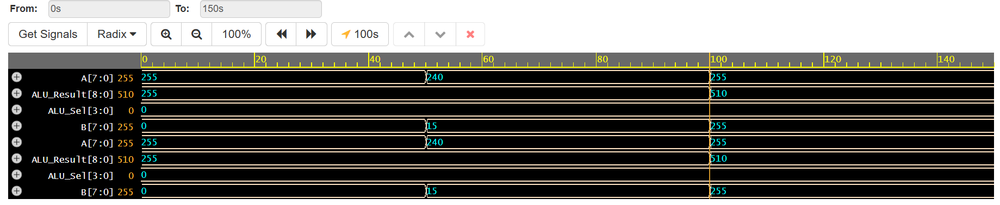
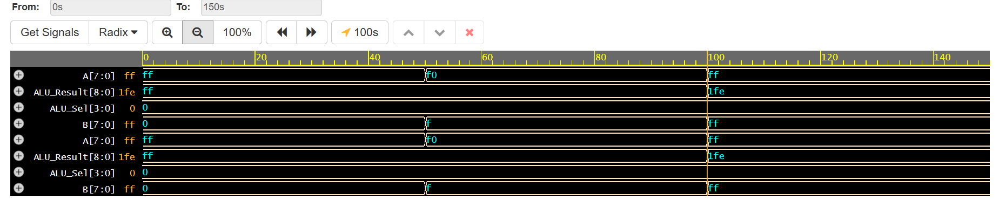
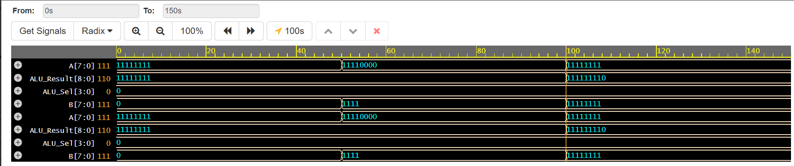
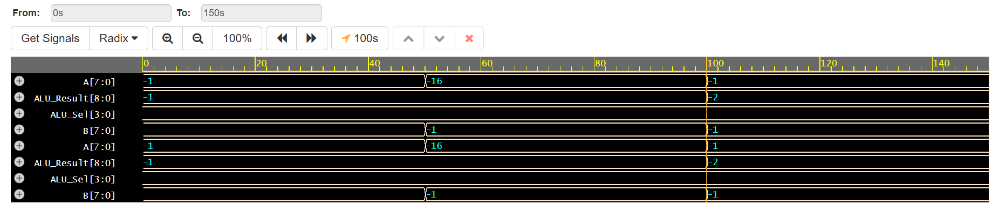
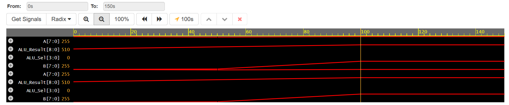

8-Bit ALU Verilog Project 

Simulation Results
This folder contains screenshots of the ALU simulation outputs captured from EDA Playground. Each waveform type demonstrates the same signals in different representations.

1. Decimal View

2. Hexadecimal View

3. Binary View

4. Signed Decimal View

5. Analogue / Waveform View

